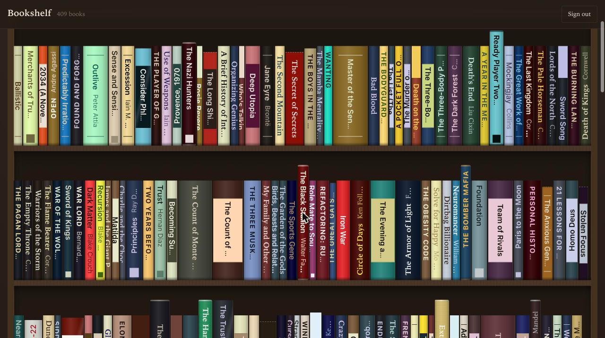

# Bookshelf

Your Goodreads library, rendered as a bookcase: spines sized to each book's real
page count and physical dimensions, coloured from its real cover art. Tap a
spine to see the cover, rate the book, and keep notes on it.

Multi-user and self-hosted as a single container. Visitors who are not signed in
get a sample shelf of real books, so the site shows what it is rather than
asking for an account first.



## How it works

**Books come from the Goodreads shelf RSS feed**, walked page by page and
accumulated in a local SQLite store. The widely repeated claim that this feed is
capped at 100 books is wrong; measured against the live endpoint:

| Request | Result |
| --- | --- |
| `list_rss/1?shelf=read` | 100 items (the default, hence the myth) |
| `&per_page=200` | 200 items |
| `&per_page=300` / `500` / `1000` | silently falls back to 100 — **200 is the real max** |
| `&page=1,2,3` | 100 each, **zero `book_id` overlap** — real pagination |
| `&per_page=200&page=1..5` | 200, 200, 200, 29, 0 — clean termination |

So one sync enumerates an entire library, unauthenticated and with no API key.
The three exclusive shelves (`read`, `currently-reading`, `to-read`) are walked
separately, because a feed item's `user_shelves` lists *custom* shelves only — a
book shelved just as "read" has an empty one, so the shelf a book belongs to can
only be known from which feed returned it.

The merge is **append-only**: new books are inserted, mutable reading state is
refreshed, and nothing is ever deleted. If Goodreads changes format or blocks
the feed, the shelf keeps rendering from the local store.

**Spines are reconstructed, not photographed.** No API serves photographs of
book spines. Each spine's colour is extracted from the real cover art, its
thickness comes from the real page count, and its height from the real physical
dimensions where those exist. Every book reports where its numbers came from,
and the UI says "estimated from 496 pages" rather than implying a measurement.
Ebooks and audiobooks get a fixed slim form instead of a page count converted
into millimetres of paper.

**You can rate a book and keep notes on it.** Both are yours, stored per account
and in separate columns from anything Goodreads sends, so a sync can never
overwrite them. Notes are searchable alongside titles and authors — a note is
often the only record of why a book mattered, or who has it.

**The shelf is yours to arrange.** Shelf material and backdrop are separate
choices rather than a handful of fixed themes, so pine planks against foliage
and black planks against ink are both a couple of clicks away. Some books can
lie flat in stacks instead of every one standing upright, and you can stand
framed photographs and other objects among the spines. Anyone browsing the
sample shelf can play with all of it too; their choices are kept locally until
there is an account to save them to.

**Spines are composed, not filled.** A real spine has an anatomy: the title
dominating the upper portion, the author below it, and an imprint mark at the
foot, divided by whatever rules, bands or plates the design calls for. Eight
layouts follow those conventions, weighted by binding so hardcovers lean toward
cloth and foil and paperbacks toward plates and bands.

**Bibliographic data is shared between accounts, reading state is not.** Two
users who own the same book share one cover download, one metadata lookup and
one palette extraction; their ratings, notes and shelves stay separate, and no
user can read another's library.

## Running it

```bash
cp .env.example .env     # nothing is strictly required; see Configuration
docker compose up -d
```

Then open the site and create an account with a username and a password. An
email address works as the username. **The first account created becomes the
administrator**, so make it yours before sharing the URL.

Goodreads details are optional at signup and can be added later from the account
panel. The user id is the number in `goodreads.com/user/show/`**`152185079`**`-name`
— a display name will not work, and is rejected with a message saying so. A
private profile also needs the RSS key from the feed link at the bottom of its
My Books page. Both fields accept a pasted URL and pull the value out of it.

The container expects to sit behind a reverse proxy; `nginx/bookshelf.conf` is a
server block for an existing nginx edge stack.

### Making it yours

**Make it yours** in the toolbar opens the look controls: five shelf materials
(pine, oak, walnut, white, black) and five backdrops (foliage, plaster,
panelling, ink, sunroom) chosen independently, plus whether some books lie flat
in stacks rather than every one standing upright. The two axes are separate on
purpose — a fixed set of themes cannot end up looking like yours.

**Add things** puts objects on the shelves: upload a photograph, pick which
shelf it stands on, and slide it along. Pictures keep their real aspect ratio,
are private to your account, and are capped at forty.

Anyone browsing the sample shelf can use the look controls too. Their choices
live in the browser until there is an account to save them to.

### Administration

Any administrator gets an **Admin** button in the top bar:

- **People** — who has an account, their Goodreads details, book counts, last
  sync and its error if it failed. Reset a password, sign someone out
  everywhere, trigger their sync, grant or remove admin, or delete an account.
  The last remaining administrator cannot be demoted or deleted.
- **Syncs** — the last 30 runs across all accounts, with what each one fetched.
- **Server** — store and enrichment totals, active rate-limit cooldowns, what
  the running system has measured about the Goodreads feed, and a switch to
  close new signups.

Deleting an account removes that person's shelf, notes and sessions but keeps
the shared `books` rows, since other accounts may shelve the same titles and
re-fetching covers and palettes is expensive.

### Configuration

Everything in `.env.example` is optional, and every empty value leaves its
subsystem inert rather than crashing. The app logs what is inactive at boot.

| Variable | Effect when empty |
| --- | --- |
| `ADMIN_API_KEY` | Admin routes still work for signed-in administrators; only the break-glass header is disabled |
| `GOOGLE_BOOKS_API_KEY` | Google Books rate-limits almost immediately; Open Library carries enrichment |
| `CONTACT_EMAIL` | Open Library applies its lower anonymous rate limit (identified requests get 3×) |
| `ENRICH_ENABLED=false` | Spines use Goodreads covers and heuristic geometry only |
| `GOODREADS_BASE_URL` | Production default; override only to point tests at a local feed |

## Development

```bash
cd server && npm install && npm test
cd client && npm install && npm run build   # builds into server/public
ADMIN_API_KEY=dev node server/src/index.js
```

`npm test` is plain `node --test` and runs fully offline — `test/rss-sink.mjs`
serves a captured feed locally, pointed at by `GOODREADS_BASE_URL`.

The demo shelf is baked into `server/src/demo/shelf.json` by
`scripts/build-demo-fixture.mjs`, so it renders in full colour on a cold
container with no network. Cover images are fetched in the background on first
boot and cached to the data volume.

### No native dependencies, on purpose

The Dockerfile installs dependencies in a `--platform=$BUILDPLATFORM` stage and
copies `node_modules` into the target-arch runtime stage, so a native binary
would be the wrong architecture on arm64. Passwords use `node:crypto` scrypt
rather than bcrypt, images decode with `jpeg-js`/`pngjs` rather than sharp, and
SQLite is the built-in `node:sqlite`. Do not add `sharp`, `canvas`,
`better-sqlite3`, `bcrypt`, `node-vibrant` or `get-image-colors`.

### Layout

```
shared/types.ts   the API contract, imported by the client
docs/API.md       the same contract in prose — write an iOS client against this
CLAUDE.md         working notes: constraints, measured feed behaviour, deploy
server/src/
  goodreads/      feed walk, parsing, the single append-only merge
  enrich/         Open Library + Google Books, dimensions, covers, worker
  palette.js      median-cut palette extraction and WCAG contrast
  demo/           the public sample shelf
  routes/         auth, books, covers, sync, admin, demo, decorations
client/src/
  components/     Spine, Shelf, Bookcase, BookSheet, Account, Admin, Decorations
  lib/            api.ts is the only fetch layer; geometry.ts; spine-style.ts
  styles/         tokens.css holds the shelf and backdrop axes as token sets
```

## Known limits

- Signup is open by design, and each account adds polling load against
  Goodreads. Every outbound request is serialised through one 1.5s-spaced
  queue, so syncs get slower as more people join rather than getting the
  instance rate-limited. Close signups from the admin panel if that becomes a
  problem.
- The Goodreads RSS feed is unofficial. It works well today, and the local store
  means a break degrades to a stale shelf rather than an empty one, but it could
  change without notice.
- Open Library's `physical_dimensions` is absent for most editions, so most
  books fall back to the page-count heuristic. `geometry.source` makes that
  visible rather than hiding it.
- Spines are a faithful reconstruction, not photographs: a book whose real spine
  is black with gold foil but whose cover is bright red will render red.
